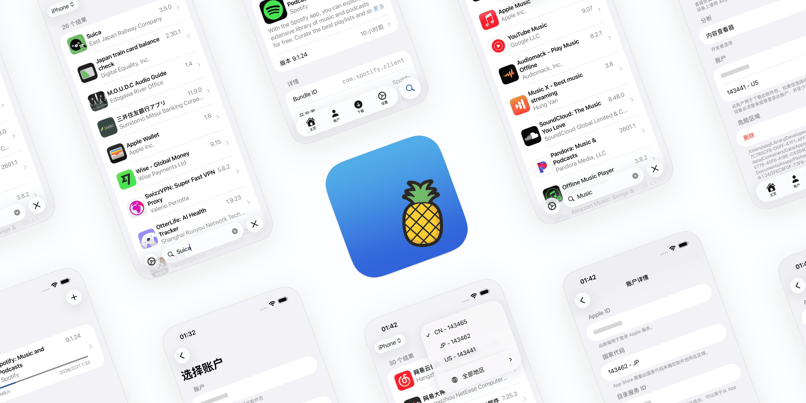

# 爱啪思道

轻松管理多个 App Store 账户。

[English 🇺🇸](../../../README.md)

## 👀 概览



## 🌟 主要功能

- **多账户管理**: 支持多个 Apple ID
- **跨区访问**: 选择您的 App Store 地区
- **应用搜索**: 按关键词搜索应用
- **应用下载**: 从 App Store 下载应用
- **IPA 安装**: 在非越狱设备上安装 IPA
- **IPA 分享**: 轻松分享 IPA 文件
- **历史版本**: 下载应用的历史版本
- **免费应用入库**: 一键将免费应用加入您的购买记录

## 📝 使用须知

### 前提条件

- [iOS App Signer](https://dantheman827.github.io/ios-app-signer/)
- 用于 `app.localhost.qaq.wiki` 的自签名证书（在“设置”中安装）

### 问题排查

- 对于类似 [#1](https://github.com/Lakr233/Asspp/issues/1) 的问题，请使用提供的签名工具。
- 如果安装失败，请确保证书已正确安装。
- 如果应用崩溃或退出，请确认您已登录 App Store 账户，并且您的设备系统版本受支持。

### 安装方式对比

| 项目             | 本地安装           | AirDrop 安装                                 |
| ---------------- | ------------------ | -------------------------------------------- |
| 设备要求         | 单台设备           | 两台设备                                     |
| App Store 兼容性 | 无法检测\*         | 兼容                                         |
| 自动更新         | 不支持             | 支持                                         |
| 前提条件         | 手动安装并信任证书 | 目标设备需登录同一账户，且已安装至少一个 App |
| 网络要求         | 需要               | 不需要                                       |

- 此安装方法不会在 App Store 中注册软件，因此无法自动更新。手动更新可以保留数据，但后续安装无法使用本软件，也无法覆盖现有应用。

## 🚀 快速上手

# iPhone

- 前往 [Releases](https://github.com/Lakr233/Asspp/releases) 页面下载最新版本 Asspp.ipa
- 使用签名软件重新签名之后安装
- 或者此[快捷指令](https://www.icloud.com/shortcuts/d3c28f125b724a2da136d560fcf360dc)
  > 复制链接后运行或者在共享页添加后，直接在打开链接时选择 Open In Sidestore
- 如果你在自己的仓库启用了自动签名流程，可直接打开安装页：
  `https://<owner>.github.io/<repo>/ios/latest/install.html`

# Mac

- 前往 [Releases](https://github.com/Lakr233/Asspp/releases) 页面下载最新版本 Asspp.zip
- 解压后打开 Asspp.app

### 首次运行与信任应用（推荐步骤）

1. 尝试双击打开应用；若出现“无法打开，因为无法确认开发者”或类似提示：
   - 在 Finder 中定位到 Asspp.app，按住 Control 键并点击应用图标，选择“打开”，在弹窗中再次点击“打开”。此操作会为该应用建立信任记录，通常只需执行一次。
2. 如果 Control+点击无效或仍受阻：
   - 打开 系统设置 -> 隐私与安全（或“系统偏好设置 -> 安全性与隐私”旧版 macOS），在“通用/安全性”区域的底部查找被阻止的应用并点击“仍要打开”或“允许”，可能需要输入管理员密码。
3. 建议从本仓库 Releases 下载并核验发布信息，确保来源可信后再按上述方法信任并打开应用。

> 说明：以上步骤是 macOS Gatekeeper 的标准处理方式，旨在保护系统安全。按照推荐流程操作可以最小化风险并确保应用能正常运行。

## 📋 已构建的包

请查看 [Releases](https://github.com/Lakr233/Asspp/releases) 页面。

## 🤖 自动签名与自动更新（GitHub Actions + GitHub Pages）

仓库已包含工作流 `.github/workflows/upstream-signed-ios.yml`，可实现：

- 每 30 分钟检查 `Lakr233/Asspp` 的 `main` 是否有新提交
- 使用你自己的开发者证书自动签名并导出 IPA
- 自动发布到 GitHub Releases
- 自动发布 GitHub Pages 固定安装页（用于 iPhone 直接安装/更新）

### 1. 前置条件

- 已付费 Apple Developer 账号
- `Ad Hoc` 描述文件（包含目标设备 UDID）
- 已启用 GitHub Actions 和 GitHub Pages 的仓库
- Pages/Releases 需可公网访问（OTA 场景建议仓库保持公开）

### 2. 开启 GitHub Actions / Pages

1. 进入 `Settings -> Actions -> General -> Workflow permissions`
2. 选择 `Read and write permissions`
3. 进入 `Settings -> Pages`
4. `Source` 选择 `GitHub Actions`

### 3. 准备签名材料

1. 在 Apple Developer 中准备：
   - App ID（Bundle ID）
   - `Apple Distribution` 证书
   - `Ad Hoc` 描述文件（勾选你的设备）
2. 在钥匙串导出 `.p12`（设置导出密码）
3. 下载 `.mobileprovision`

### 4. 转成 base64

在 macOS 执行：

```bash
base64 -i your_cert.p12 | tr -d '\n'
base64 -i your_profile.mobileprovision | tr -d '\n'
```

### 5. 配置 Secrets

在 `Settings -> Secrets and variables -> Actions -> Secrets` 配置：

| 名称                              | 必填 | 说明                            |
| --------------------------------- | ---- | ------------------------------- |
| `IOS_CERT_P12_BASE64`             | 是   | `.p12` 的 base64                |
| `IOS_CERT_PASSWORD`               | 是   | `.p12` 导出密码                 |
| `IOS_PROVISIONING_PROFILE_BASE64` | 是   | `.mobileprovision` 的 base64    |
| `IOS_KEYCHAIN_PASSWORD`           | 否   | Runner 临时 keychain 密码       |
| `IOS_TEAM_ID`                     | 否   | Team ID（不填则从描述文件读取） |

### 6. 配置 Variables

在 `Settings -> Secrets and variables -> Actions -> Variables` 配置：

| 名称                   | 必填 | 示例                      | 说明                                |
| ---------------------- | ---- | ------------------------- | ----------------------------------- |
| `IOS_EXPORT_METHOD`    | 否   | `ad-hoc`                  | 默认 `ad-hoc`                       |
| `IOS_SIGNING_IDENTITY` | 否   | `Apple Distribution`      | 留空则按导出方式自动选择            |
| `IOS_BUNDLE_ID`        | 否   | `wiki.qaq.Asspp`          | 覆盖 Bundle ID（需与描述文件匹配）  |
| `IOS_OTA_BASE_URL`     | 否   | `https://app.example.com` | OTA 基础 URL，默认使用 GitHub Pages |

### 7. 可选：配置自定义域名

1. 在 `Settings -> Pages` 添加自定义域名
2. DNS 指向 GitHub Pages
3. 将 `IOS_OTA_BASE_URL` 设置为你的 HTTPS 域名（不要尾部 `/`）

### 8. 首次运行与验证

1. 打开 `Actions -> Upstream Signed iOS Build`
2. 点击 `Run workflow` 手动触发一次
3. 成功后可用地址：
   - Releases: `https://github.com/<owner>/<repo>/releases`
   - 安装页: `https://<owner>.github.io/<repo>/ios/latest/install.html`
   - Manifest: `https://<owner>.github.io/<repo>/ios/latest/manifest.plist`

如果仓库名本身就是 `<owner>.github.io`，URL 中不会有 `/<repo>` 这一段。

### 9. 日常使用

- 工作流每 30 分钟轮询一次上游
- 上游 `main` 有新提交时自动构建、签名、发布
- `ios/latest/install.html` 永远指向最新可安装版本

## 🧑‍⚖️ 开源许可

自 2.2.16 版本起，本项目采用 [MIT](../../../LICENSE) 许可证。

## 🥰 鸣谢

- [ipatool](https://github.com/majd/ipatool)
- [ipatool-ios](https://github.com/dlevi309/ipatool-ios)
- [localhost.direct](https://get.localhost.direct/)

_`ipatool-ios` 和 `localhost.direct` 已在当前项目中不再使用。_

---

Copyright © 2025 Lakr Aream. All Rights Reserved.
